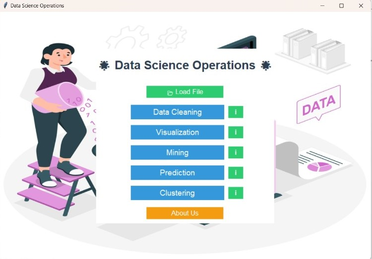
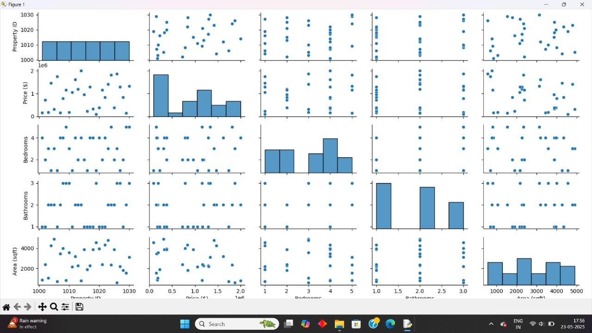

# Smart Data Hub

Smart Data Hub is a comprehensive platform designed to provide multiple data science technologies including data visualization, data mining, data cleaning, and predictive analytics. It supports various input formats like XML, CSV, Word, and Text files to help users perform advanced data operations efficiently.

---

## Key Features

- Upload and manage multiple data file formats (XML, CSV, Word, Text).  
- Apply data science techniques: visualization, mining, cleaning, and predictive analysis.  
- User-friendly interface with dynamic modules for easy interaction.  
- Secure data handling and efficient backend processing.  
- Real-time results with options to export processed data.

---

## Agile Practice & Process Improvement

- **Participated in weekly Agile ceremonies** including *Sprint Planning*, *Daily Stand-ups*, *Sprint Reviews*, and *Retrospectives* to ensure team alignment and continuous improvement.  
- Helped **reduce cycle time by 15%** through better planning, faster issue resolution, and more efficient task execution.  
- Ensured on-time task delivery by actively engaging in discussions, prioritizing work, and following structured workflows.

---

## Screenshots

### Dashboard Interface  
  
*Main dashboard showcasing data upload and analysis features.*

### Data Visualization Module  
  
*Example of charts and graphs generated by the system.*

### Cleaning Module  
  
*Cleaning dashboard showcasing data  and cleaning features.*

### Mining Module  
  
*Mining dashboard showcasing data  and mining features.*

### Predection Module  
  
*Predection dashboard showcasing data Predection.*

---

## How to Run

1. Clone the repository  
```bash
git clone https://github.com/yourusername/smart-data-hub.git
